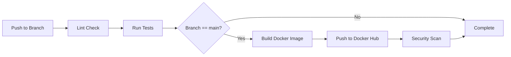

# Fantasy F1 Backend API

Backend API for the Fantasy F1 application built with FastAPI, PostgreSQL, Redis, and Celery.

## 🚀 Quick Start

### Prerequisites

- Docker and Docker Compose installed
- Git

### Local Development

1. Clone the repository:
```bash
git clone https://github.com/famgala/FantasyF1_BE.git
cd FantasyF1_BE
```

2. Configure environment variables:
```bash
cp .env.example .env
# Edit .env with your desired configuration
```

3. Start all services:
```bash
docker-compose up -d
```

4. Access the API:
- API: http://localhost:8000
- API Documentation (Swagger): http://localhost:8000/docs
- API Documentation (ReDoc): http://localhost:8000/redoc
- Flower (Celery Monitoring): http://localhost:5555

### Using Pre-built Docker Images

If you want to use the pre-built images from Docker Hub instead of building locally:

```bash
export IMAGE=famgala/fantasyf1-be:latest
docker-compose up -d
```

## 📋 CI/CD Pipeline

The project uses GitHub Actions for continuous integration and deployment.

### Pipeline Stages

1. **Lint & Format Check**
   - Runs Black formatter check
   - Runs Ruff linter
   - Runs mypy type checker

2. **Test**
   - Runs pytest with coverage
   - Uses PostgreSQL and Redis services
   - Uploads coverage to Codecov

3. **Build & Push**
   - Only runs on pushes to `main` branch
   - Builds Docker image using multi-stage build
   - Pushes image to Docker Hub (famgala/fantasyf1-be)
   - Uses GitHub secrets for authentication

4. **Security Scan**
   - Runs Trivy vulnerability scanner
   - Uploads results to GitHub Security

### GitHub Secrets Configuration

The following secrets must be configured in your GitHub repository:

- `DOCKER_HUB_USERNAME`: Your Docker Hub username
- `DOCKER_HUB_ACCESS_TOKEN`: Docker Hub access token (PAT)

To create a Docker Hub access token:
1. Go to https://hub.docker.com/settings/security
2. Generate a new Access Token with Read & Write permissions
3. Add the token to your GitHub repository secrets

### Triggering the Pipeline

The CI/CD pipeline runs automatically on:

- Pushes to: `main`, `dev_sprint_phase1`, `dev_sprint_phase2`, `dev_sprint_phase3`, `dev_sprint_phase4`, `dev_sprint_phase5`
- Pull requests to: `main`

Only pushes to `main` will trigger the Docker image build and push to Docker Hub.

### Pipeline Workflow



## 🐳 Docker Services

### Available Services

- **app**: FastAPI application
- **celery_worker**: Background task processor
- **celery_beat**: Scheduled task scheduler
- **flower**: Celery monitoring UI
- **postgres**: PostgreSQL database
- **redis**: Redis cache and message broker

### Docker Compose Commands

```bash
# Start all services
docker-compose up -d

# Start only database services
docker-compose up postgres redis

# Stop all services
docker-compose down

# Stop all services and remove volumes
docker-compose down -v

# View logs
docker-compose logs -f app

# Restart a service
docker-compose restart app

# Rebuild and start
docker-compose up -d --build app
```

## 🔧 Development

### Running Tests Locally

```bash
# Install dependencies in a virtual environment
python -m venv venv
source venv/bin/activate  # On Windows: venv\Scripts\activate
pip install -r requirements-dev.txt

# Run tests with coverage
pytest tests/ --cov=app --cov-report=html

# Run tests without coverage
pytest tests/
```

### Running All CI Checks Locally

**⚠️ IMPORTANT:** Before pushing your changes, run ALL CI checks locally to ensure they pass. This prevents failed pipelines.

**On Windows:**
```bash
run_ci_checks.bat
```

**On Linux/Mac:**
```bash
chmod +x run_ci_checks.sh
./run_ci_checks.sh
```

This script runs all the exact same checks that GitHub Actions will run:
1. Black formatter check
2. Ruff linter check
3. mypy type checker
4. pytest with coverage

Only push if all checks pass locally!

### Code Quality Tools

```bash
# Format code with Black
black app/ tests/

# Check code with Ruff
ruff check app/ tests/

# Run type checker
mypy app/

# Run all checks
black --check app/ tests/ && ruff check app/ tests/ && mypy app/
```

**Note:** All Python files are formatted with Black and include trailing newlines to pass CI/CD checks.

### Project Structure

```
FantasyF1_BE/
├── .github/
│   └── workflows/
│       └── ci.yml                 # CI/CD pipeline configuration
├── alembic/
│   ├── versions/                 # Database migration scripts
│   ├── env.py                    # Alembic environment configuration
│   └── ini                       # Alembic configuration
├── app/
│   ├── api/
│   │   └── v1/
│   │       └── endpoints/        # API endpoint modules (to be filled in Phase 2)
│   ├── cache/
│   │   ├── client.py             # Redis client factory
│   │   └── utils.py              # Cache utility functions
│   ├── core/
│   │   ├── config.py             # Configuration management
│   │   ├── dependencies.py       # FastAPI dependency factories
│   │   ├── exceptions.py         # Custom exception classes
│   │   ├── logging.py            # Logging configuration
│   │   └── security.py           # Security utilities (JWT, password hashing)
│   ├── db/
│   │   ├── base.py               # SQLAlchemy declarative base
│   │   └── session.py            # Database session management
│   ├── main.py                   # FastAPI application entry point
│   ├── __init__.py
│   └── tasks/
│       ├── __init__.py
│       ├── celery_app.py         # Celery application configuration
│       └── data_sync.py          # Data synchronization tasks
├── tests/
│   ├── conftest.py               # Pytest fixtures and configuration
│   ├── test_main.py              # Test suite
│   └── test_health_async.py      # Async health endpoint tests
├── .dockerignore                 # Docker build exclusions
├── .env                          # Environment variables (not committed)
├── .env.example                 # Environment variables template
├── .gitignore                    # Git exclusions
├── Dockerfile                    # Multi-stage Docker build file
├── docker-compose.yml            # Docker orchestration file
├── mypy.ini                      # MyPy type checker configuration
├── pyproject.toml                # Code quality tools configuration
├── requirements.txt              # Production dependencies
└── requirements-dev.txt          # Development dependencies
```

## ✅ Phase Status

### Current Status: Phase 1 Complete ✅

**Phase 1** (Infrastructure Setup) has been successfully completed. The project now has:

- ✅ Complete directory structure created
- ✅ Configuration and environment management
- ✅ Database setup with SQLAlchemy async
- ✅ Alembic migrations configured
- ✅ Cache setup with Redis
- ✅ Core utilities (security, logging, exceptions)
- ✅ FastAPI application skeleton with CORS
- ✅ Testing infrastructure with pytest
- ✅ Code quality tools (Black, Ruff, MyPy)
- ✅ CI/CD pipeline configured
- ✅ Docker configuration complete

**Next Steps**: Begin **Phase 2** (Data Models & API Structure) as outlined in `DEV_PHASES.md`.

## 📦 Docker Image Tags

The CI/CD pipeline automatically tags Docker images with:

- Branch name (e.g., `dev_sprint_phase1`, `main`)
- Pull request number
- Semantic version tags (when releases are tagged)

Example tags:
- `famgala/fantasyf1-be:main`
- `famgala/fantasyf1-be:dev_sprint_phase1`
- `famgala/fantasyf1-be:latest` (points to main branch)

## 🔒 Security

- Multi-stage Docker build to minimize image size and attack surface
- Non-root user in Docker container
- Security scanning with Trivy on every main branch build
- Secrets managed via GitHub Actions secrets
- .env files are gitignored and never committed

## 🚦 Health Checks

The application includes health check endpoints:

- `GET /health` Returns service health status
- `GET /` Returns API information

Docker health checks are configured for all services.

## 📝 Environment Variables

See `.env.example` for all available environment variables. Key variables include:

- `DATABASE_URL`: PostgreSQL connection string
- `REDIS_URL`: Redis connection string
- `CELERY_BROKER_URL`: Celery broker URL (Redis)
- `CELERY_RESULT_BACKEND`: Celery result backend URL (Redis)
- `PORT`: API port (default: 8000)
- `DEBUG`: Debug mode (default: false)

## 🤝 Contributing

1. Create a feature branch from `main`
2. Make your changes
3. Ensure all tests pass and code quality checks pass
4. Push to your branch
5. Create a pull request to `main`

The CI/CD pipeline will automatically run all checks on your pull request.

## � License

See LICENSE file for details.